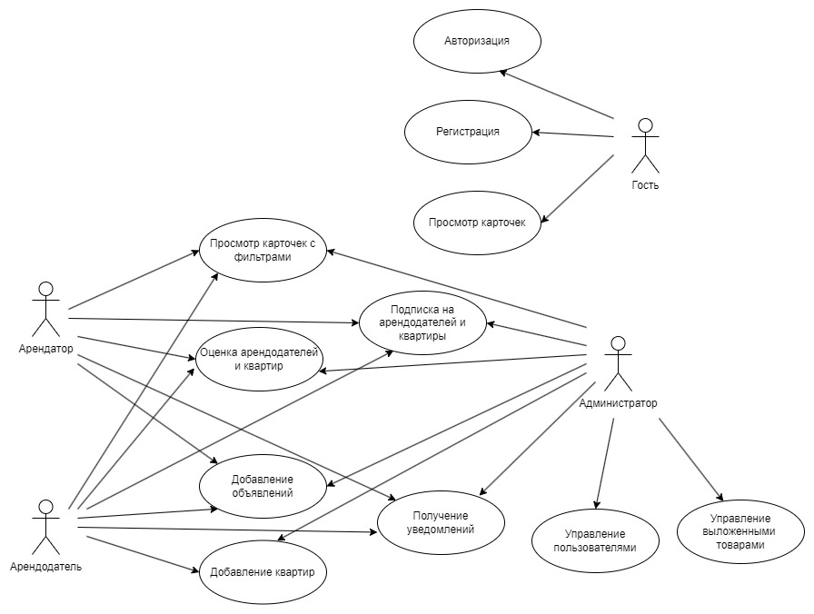

# ОбщагиНет (@SayNoToHostelBot)

## Тема
Разработка Telegram-бота для добавления, поиска жилья и нахождения соседей с системой подписок.

## Роли
1) Гость;
2) Арендатор;
3) Арендодатель;
4) Администратор.

## Функциональные требования

|                      Функционал                      |Готовность|
|:----------------------------------------------------:|:--------:|
|Регистрация арендатора                                |    +     |
|Регистрация арендодателя                              |    +     |
|Админка (арендаторы)                                  |    +     |
|Админка (арендодатели)                                |    +     |
|Админка (квартиры)                                    |    +     |
|Админка (соседство)                                   |    +     |
|Админка (объявления)                                  |    +     |
|Добавление квартир                                    |    +     |
|Просмотр квартир                                      |    +     |
|Пагинация квартир                                     |    +     |
|Просмотр квартир (фильтры)                            |    +     |
|Подписка на новые квартиры                            |    -     |
|Отметка понравившихся квартир                         |    +?    |
|Получение уведомлений о лайках                        |    +?    |
|Добавление, поиск объявлений о соседстве              |    -     |
|Добавление, поиск объявлений о товарах                |    -     |
|Подписка на арендодателей                             |    +?    |
|Выставление оценок арендодателям                      |    +     |
|Просмотр информации об арендодателе                   |    +     |

## ER-модель в нотации Чена

## Администратор
Предлагается отдельный интерфейс, позволяющий администратору управлять таблицами базы данных: получать данные, добавлять, изменять, удалять, генерировать. Данные функции доступны для следующих сущностей:
- Арендаторы
- Арендодатели
- Квартиры
- Объявления о соседстве
- Объявления о товарах

## Гость
### Регистрация
Пользователь вводит одну из команд: /register_tenant или /register_landlord. В зависимости от этого предлагается ввести данные для регистрации как арендатор и арендодатель соответственно. Для арендатора - полное имя, возраст, пол, город, персональные качества, платежеспособность. Для арендодателя - полное имя, возраст, город.
### Просмотр квартир
Имеет право на просмотр квартир путем вызова команды /get_flats. Бот отправляет список карточек, которые содержат следующую информацию:

- Фотографии
- Владелец
- Стоимость
- Площадь
- Адрес
- Ближайшее метро
- Этаж
- Описание

