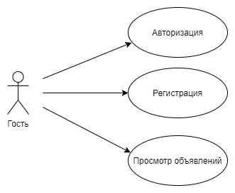
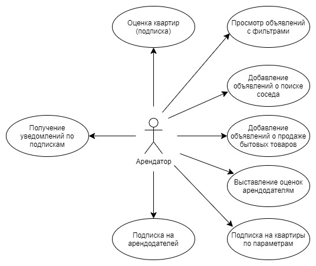
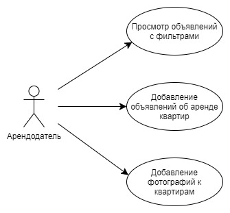
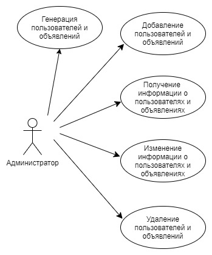
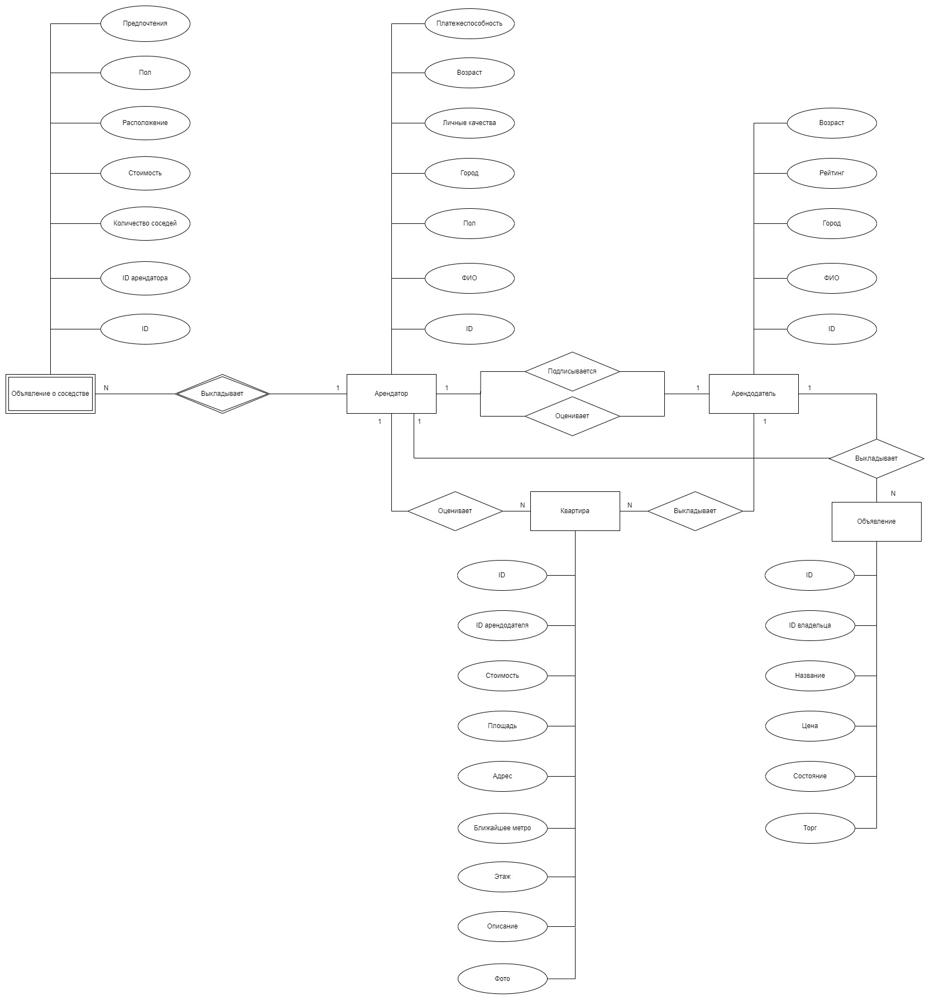

# ОбщагиНет (@SayNoToHostelBot)

## Тема
Разработка Telegram-бота для добавления, поиска жилья и нахождения соседей с системой подписок.

## Роли
1) Гость;
2) Арендатор;
3) Арендодатель;
4) Администратор.

## Функциональные требования

|                      Функционал                      |Готовность|
|:----------------------------------------------------:|:--------:|
|Регистрация арендатора                                |    +     |
|Регистрация арендодателя                              |    +     |
|Админка (арендаторы)                                  |    +     |
|Админка (арендодатели)                                |    +     |
|Админка (квартиры)                                    |    +     |
|Админка (соседство)                                   |    +     |
|Админка (объявления)                                  |    +     |
|Добавление квартир                                    |    +     |
|Просмотр квартир                                      |    +     |
|Пагинация квартир                                     |    +     |
|Просмотр квартир (фильтры)                            |    +     |
|Подписка на новые квартиры                            |    +     |
|Отметка понравившихся квартир                         |    +     |
|Получение уведомлений о лайках                        |    +     |
|Добавление, поиск объявлений о соседстве              |    +     |
|Добавление, поиск объявлений о товарах                |    +     |
|Подписка на арендодателей                             |    +     |
|Выставление оценок арендодателям                      |    +     |
|Просмотр информации об арендодателе                   |    +     |

## ER-модель в нотации Чена

